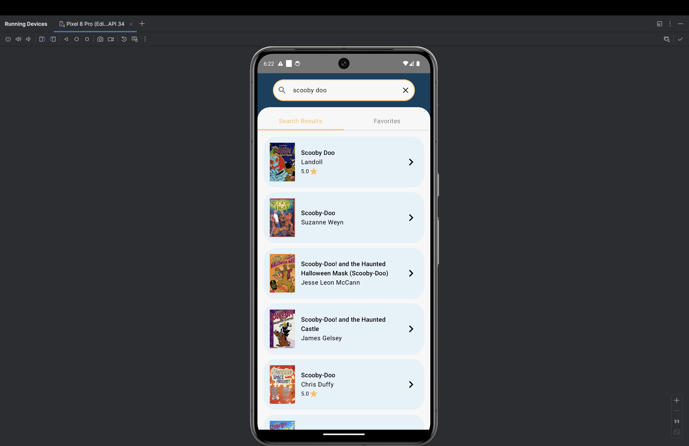
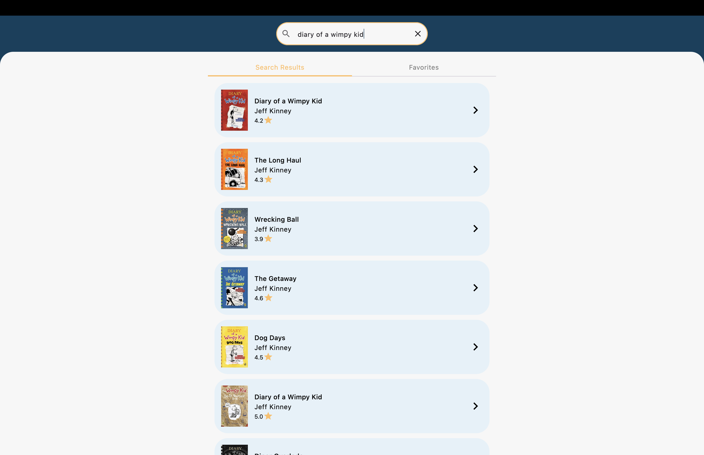
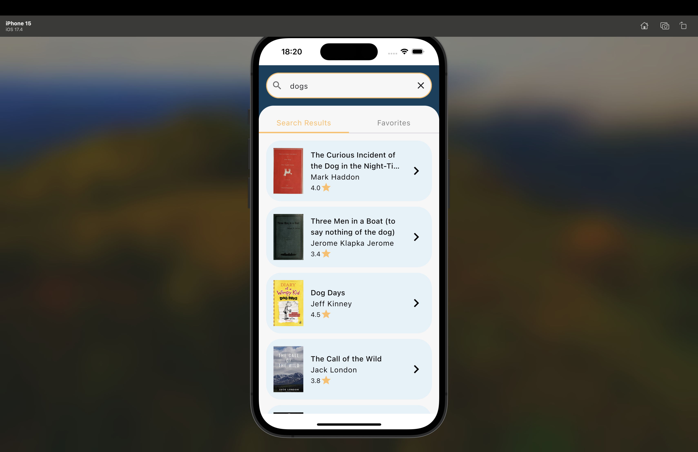

Bookpedia is a Kotlin Multiplatform project targeting Android, iOS, Desktop.

Bookpedia allows users to search and save book entries via data fetched from a remote book API.

Bookpedia is a complete course project written in Kotlin and powered by Jetpack Compose, which is based off (https://github.com/philipplackner/CMP-Bookpedia) by [https://www.youtube.com/@PhilippLackner].

It is a Single Module Project that incorporates the following:

The Local Data part is handled by a Room DB.
The Remote Data part is handled by Ktor.
The Navigation is handled by navigation compose.
The DI (Dependency Injection) is handled by Koin.

This project is a valuable resource for developers seeking to use a remote and local data source with KMP.

# :camera_flash: **Screenshots** :camera_flash:

Bookpedia follows the latest Material 3 guidelines for a visually appealing and a consistent UI. Below are 3 screenshots of the app across ios, android and desktop environments.

<b><i>Android</i></b>
  

  <b><i>Desktop</i></b>
  

  <b><i>IOS</i></b>

  

* `/composeApp` is for code that will be shared across your Compose Multiplatform applications.
  It contains several subfolders:
  - `commonMain` is for code that’s common for all targets.
  - Other folders are for Kotlin code that will be compiled for only the platform indicated in the folder name.
    For example, if you want to use Apple’s CoreCrypto for the iOS part of your Kotlin app,
    `iosMain` would be the right folder for such calls.

* `/iosApp` contains iOS applications. Even if you’re sharing your UI with Compose Multiplatform,
  you need this entry point for your iOS app. This is also where you should add SwiftUI code for your project.

Learn more about [Kotlin Multiplatform](https://www.jetbrains.com/help/kotlin-multiplatform-dev/get-started.html)…
